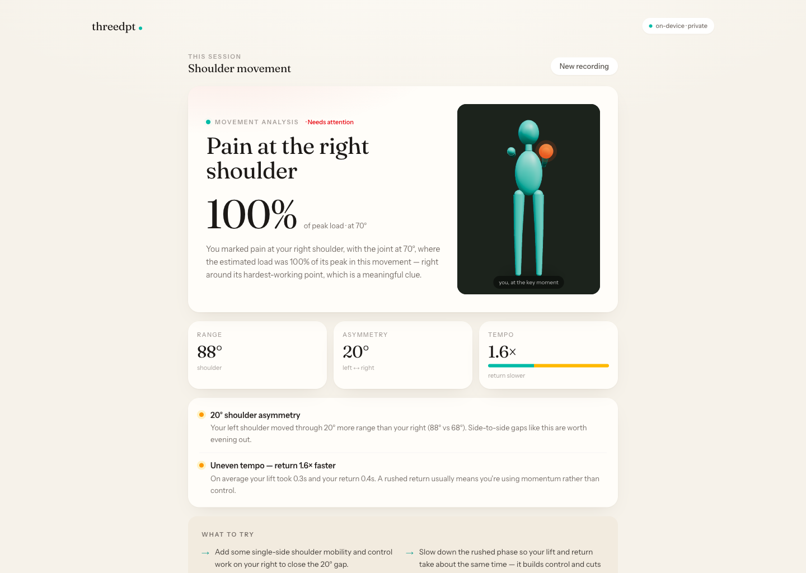
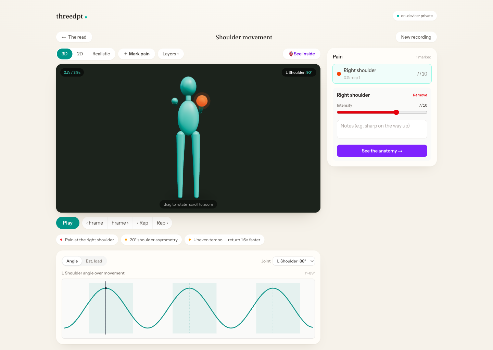

# threedpt

**Markerless movement analysis in the browser.** Record a movement through an ordinary webcam and get an instant, clinician-style read on your form — reps, range of motion, left/right asymmetry, tempo, and estimated joint load — then pinpoint pain to a specific joint and moment and reveal the anatomy underneath.

Everything runs **on-device**. The camera feed never leaves your machine.

<p align="center">
  
  &nbsp;
  
</p>
<p align="center"><sub><b>The Read</b> — glance at the analysis &nbsp;·&nbsp; <b>The Lab</b> — interrogate the motion</sub></p>

> ⚠️ **Not a medical device.** Angles, loads, and anatomy are estimated from a single camera and are meant to help you *observe and describe* how you move — never to diagnose an injury or replace a licensed clinician.

## What it does

- **Live pose tracking** — MediaPipe Pose (33 landmarks) at real-time frame rates, GPU with CPU fallback, with temporal smoothing.
- **Capture & timeline** — record a movement, scrub it frame by frame, auto-count reps on the joint that moved most.
- **The Read** — a one-glance analysis: a graded verdict, a hero metric, three vitals (range · asymmetry · tempo), and your body reconstructed in 3D at the key moment. All deterministic — every statement is traceable to a measured number, nothing is hallucinated.
- **The Lab** — an interactive instrument: rotate the 3D body, scrub via the angle chart, click a finding to jump to its moment, tint joints by estimated load.
- **Pain → anatomy** — mark where it hurts on the 3D body; a curated atlas of the joint's real structures (tendons, ligaments, nerves…) opens in a slide-over, tied to the exact movement phase, alongside an illustrative cross-section.

## Stack

- [Next.js](https://nextjs.org) (App Router) · React · TypeScript
- [Tailwind CSS](https://tailwindcss.com) v4 · Fraunces + Instrument Sans (via `next/font`)
- [MediaPipe Tasks Vision](https://ai.google.dev/edge/mediapipe) — pose landmarking
- [Three.js](https://threejs.org) · [@react-three/fiber](https://github.com/pmndrs/react-three-fiber) · drei — the 3D body
- [Zustand](https://github.com/pmndrs/zustand) — session state

## Getting started

```bash
npm install
npm run dev
```

Open [http://localhost:3000](http://localhost:3000). No webcam? Use **▶ Try a sample clip** — the bundled video is fed through the exact same pose pipeline as a live camera.

## How the analysis works

The "coach" is a **deterministic engine**, not an LLM — a deliberate choice for a health tool, so it can't invent clinical claims:

- `src/lib/pose/*` — landmarks, joint-angle math, one-euro smoothing, rep detection, gravitational joint-load estimation (Winter anthropometry).
- `src/lib/analysis/metrics.ts` — range of motion, L/R asymmetry, tempo, fatigue trend, pain-to-load correlation.
- `src/lib/analysis/coach.ts` — turns those measurements into ranked findings, a headline, and a plain-language plan.

## Assets & licensing

- **Code** — MIT (see [`LICENSE`](./LICENSE)).
- **Default 3D avatar** — `public/models/Human.glb`, [Quaternius](https://quaternius.com) (CC0). You can upload your own standard-rigged humanoid `.glb` at runtime; retargeting is rig-agnostic.
- **Anatomy illustrations & sample clip** (`public/anatomy/*`, `public/demo/*`) — AI-generated and used for illustrative/demo purposes only; labeled as such in the UI. They are not photographs of any real person or diagnostic images.

## Roadmap ideas

Depth estimation for metric 3D from one camera, session history & progress tracking, guided assessments with good-form baselines, and accounts/storage. Contributions welcome.
